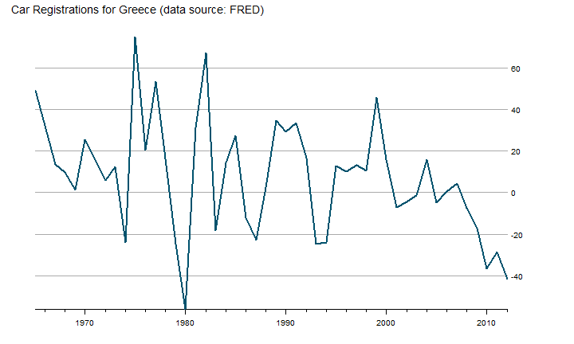
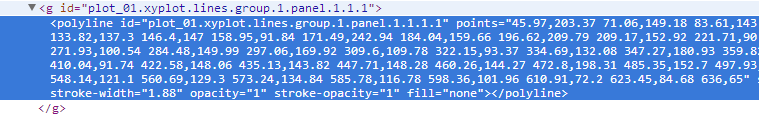

  
<style>
body{
  font-family: 'Oxygen', sans-serif;
  font-size: 16px;
  line-height: 24px;
}

h1,h2,h3,h4 {
font-family: 'Raleway', sans-serif;
}

.container { width: 900px; }

h3 {
background-color: #D4DAEC;
  text-indent: 100px; 
}

h4 {
text-indent: 100px;
}
</style>
  
<a href="https://github.com/timelyportfolio/gridSVG_d3_line"></a>

# gridSVG Data Binding with a Lattice Line

In [I Want ggplot2/lattice and d3 (gridSVG–The Glue)](http://timelyportfolio.blogspot.com/2013/08/gridsvganother-glue-for-r-to-svg.html) I demonstrated a trick I call "a d3 reverse data bind" on a ggplot2 scatterplot graph.  I discovered that lines are slightly more difficult to reverse data bind with d3.  *As an example of how this can be done without d3, see [Paul Murrell's example](https://www.stat.auckland.ac.nz/~paul/gridSVG/logoplot.svg).*  Let's look at the extra steps needed to make it happen on a line chart from the [OECD data recently added to FRED](http://news.research.stlouisfed.org/2013/07/58000-main-economic-indicators-mei-from-the-oecd-added-to-fred/).  Retail Trade Sales: Passenger Car Registrations for Greece (SLRTCR03GRA657S) seems like something interesting.


```r
#get the latest version of gridSVG
#install.packages("gridSVG", repos="http://R-Forge.R-project.org")

require(latticeExtra)
require(gridSVG)
require(quantmod)

#get data from FRED
greekCars <- na.omit(
  getSymbols("SLRTCR03GRA657S", src="FRED", auto.assign=F)
)
```


### Draw Our Line Graph with Lattice 

Let's use `lattice` this time instead of `ggplot2`.  We will draw a basic line graph to keep it simple.


```r
p1 <- xyplot(
  greekCars,
  par.settings = theEconomist.theme(
    box = "transparent"
  ),
  lattice.options = theEconomist.opts(),
  scales = list(y = list(rot=0)),
  xlab = NULL,
  main = "Car Registrations for Greece (data source: FRED) "
)
p1
```

 


### Export to SVG

Now that we have our graph, we will need to export it to SVG with `grid.export`.  When we supply `NULL` or `""` to `grid.export`, we can get the SVG without saving as a file.


```r
p1
oursvg <- grid.export("")

cat(saveXML(oursvg$svg))
```

<svg xmlns="http://www.w3.org/2000/svg" xmlns:xlink="http://www.w3.org/1999/xlink" width="720px" height="432px" viewBox="0 0 720 432" version="1.1">
  <metadata xmlns:gridsvg="http://www.stat.auckland.ac.nz/~paul/R/gridSVG/">
    <gridsvg:generator name="gridSVG" version="1.3-0" time="2013-08-08 15:15:05"/>
    <gridsvg:argument name="name" value=""/>
    <gridsvg:argument name="exportCoords" value="none"/>
    <gridsvg:argument name="exportMappings" value="none"/>
    <gridsvg:argument name="exportJS" value="none"/>
    <gridsvg:argument name="res" value="72"/>
    <gridsvg:argument name="prefix" value=""/>
    <gridsvg:argument name="addClasses" value="FALSE"/>
    <gridsvg:argument name="indent" value="TRUE"/>
    <gridsvg:argument name="htmlWrapper" value="FALSE"/>
    <gridsvg:argument name="usePaths" value="vpPaths"/>
    <gridsvg:argument name="uniqueNames" value="TRUE"/>
    <gridsvg:separator name="id.sep" value="."/>
    <gridsvg:separator name="gPath.sep" value="::"/>
    <gridsvg:separator name="vpPath.sep" value="::"/>
  </metadata>
  <g transform="translate(0, 432) scale(1, -1)">
    <g id="gridSVG" fill="none" stroke="rgb(0,0,0)" stroke-dasharray="none" stroke-width="0.75" font-size="12" font-family="Helvetica, Arial, FreeSans, Liberation Sans, Nimbus Sans L, sans-serif" opacity="1" stroke-linecap="round" stroke-linejoin="round" stroke-miterlimit="10" stroke-opacity="1" fill-opacity="0" font-weight="normal" font-style="normal">
      <g id="plot_01.background.1">
        <rect id="plot_01.background.1.1" x="0" y="0" width="720" height="432" fill="none" stroke="none" stroke-opacity="0" fill-opacity="0"/>
      </g>
      <g id="plot_01.toplevel.vp.1" font-size="12">
        <g id="plot_01.toplevel.vp::plot_01.main.vp.1">
          <g id="plot_01.main.1">
            <g id="plot_01.main.1.1" transform="translate(14.17, 420.97)" stroke-width="0.1">
              <g id="plot_01.main.1.1.scale" transform="scale(1, -1)">
                <text x="0" y="0" id="plot_01.main.1.1.text" text-anchor="start" opacity="1" stroke="rgb(0,0,0)" fill="rgb(0,0,0)" stroke-opacity="1" fill-opacity="1" font-size="14.4" font-weight="normal" font-style="normal">
                  <tspan id="plot_01.main.1.1.tspan.1" dy="5.03" x="0">Car Registrations for Greece (data source: FRED) </tspan>
                </text>
              </g>
            </g>
          </g>
        </g>
        <g id="plot_01.toplevel.vp::plot_01.figure.vp.1"/>
        <defs>
          <clipPath id="plot_01.toplevel.vp::plot_01.panel.1.1.vp.1.clipPath">
            <rect x="45.97" y="42.19" width="590.03" height="344.75" fill="none" stroke="none"/>
          </clipPath>
        </defs>
        <g id="plot_01.toplevel.vp::plot_01.panel.1.1.vp.1" clip-path="url(#plot_01.toplevel.vp::plot_01.panel.1.1.vp.1.clipPath)"/>
        <g id="plot_01.toplevel.vp::plot_01.strip.1.1.off.vp.1"/>
        <g id="plot_01.toplevel.vp::plot_01.strip.left.1.1.off.vp.1"/>
        <g id="plot_01.toplevel.vp::plot_01.panel.1.1.off.vp.1">
          <g id="plot_01.ticks.bottom.panel.1.1.1">
            <polyline id="plot_01.ticks.bottom.panel.1.1.1.1" points="108.73,42.19 108.73,36.52" stroke="rgb(0,0,0)" opacity="1" stroke-dasharray="none" stroke-width="0.75" stroke-opacity="1" fill="none"/>
            <polyline id="plot_01.ticks.bottom.panel.1.1.1.2" points="234.26,42.19 234.26,36.52" stroke="rgb(0,0,0)" opacity="1" stroke-dasharray="none" stroke-width="0.75" stroke-opacity="1" fill="none"/>
            <polyline id="plot_01.ticks.bottom.panel.1.1.1.3" points="359.82,42.19 359.82,36.52" stroke="rgb(0,0,0)" opacity="1" stroke-dasharray="none" stroke-width="0.75" stroke-opacity="1" fill="none"/>
            <polyline id="plot_01.ticks.bottom.panel.1.1.1.4" points="485.35,42.19 485.35,36.52" stroke="rgb(0,0,0)" opacity="1" stroke-dasharray="none" stroke-width="0.75" stroke-opacity="1" fill="none"/>
            <polyline id="plot_01.ticks.bottom.panel.1.1.1.5" points="610.91,42.19 610.91,36.52" stroke="rgb(0,0,0)" opacity="1" stroke-dasharray="none" stroke-width="0.75" stroke-opacity="1" fill="none"/>
            <polyline id="plot_01.ticks.bottom.panel.1.1.1.6" points="58.51,42.19 58.51,39.35" stroke="rgb(0,0,0)" opacity="1" stroke-dasharray="none" stroke-width="0.75" stroke-opacity="1" fill="none"/>
            <polyline id="plot_01.ticks.bottom.panel.1.1.1.7" points="83.61,42.19 83.61,39.35" stroke="rgb(0,0,0)" opacity="1" stroke-dasharray="none" stroke-width="0.75" stroke-opacity="1" fill="none"/>
            <polyline id="plot_01.ticks.bottom.panel.1.1.1.8" points="133.82,42.19 133.82,39.35" stroke="rgb(0,0,0)" opacity="1" stroke-dasharray="none" stroke-width="0.75" stroke-opacity="1" fill="none"/>
            <polyline id="plot_01.ticks.bottom.panel.1.1.1.9" points="158.95,42.19 158.95,39.35" stroke="rgb(0,0,0)" opacity="1" stroke-dasharray="none" stroke-width="0.75" stroke-opacity="1" fill="none"/>
            <polyline id="plot_01.ticks.bottom.panel.1.1.1.10" points="184.04,42.19 184.04,39.35" stroke="rgb(0,0,0)" opacity="1" stroke-dasharray="none" stroke-width="0.75" stroke-opacity="1" fill="none"/>
            <polyline id="plot_01.ticks.bottom.panel.1.1.1.11" points="209.17,42.19 209.17,39.35" stroke="rgb(0,0,0)" opacity="1" stroke-dasharray="none" stroke-width="0.75" stroke-opacity="1" fill="none"/>
            <polyline id="plot_01.ticks.bottom.panel.1.1.1.12" points="259.38,42.19 259.38,39.35" stroke="rgb(0,0,0)" opacity="1" stroke-dasharray="none" stroke-width="0.75" stroke-opacity="1" fill="none"/>
            <polyline id="plot_01.ticks.bottom.panel.1.1.1.13" points="284.48,42.19 284.48,39.35" stroke="rgb(0,0,0)" opacity="1" stroke-dasharray="none" stroke-width="0.75" stroke-opacity="1" fill="none"/>
            <polyline id="plot_01.ticks.bottom.panel.1.1.1.14" points="309.6,42.19 309.6,39.35" stroke="rgb(0,0,0)" opacity="1" stroke-dasharray="none" stroke-width="0.75" stroke-opacity="1" fill="none"/>
            <polyline id="plot_01.ticks.bottom.panel.1.1.1.15" points="334.69,42.19 334.69,39.35" stroke="rgb(0,0,0)" opacity="1" stroke-dasharray="none" stroke-width="0.75" stroke-opacity="1" fill="none"/>
            <polyline id="plot_01.ticks.bottom.panel.1.1.1.16" points="384.91,42.19 384.91,39.35" stroke="rgb(0,0,0)" opacity="1" stroke-dasharray="none" stroke-width="0.75" stroke-opacity="1" fill="none"/>
            <polyline id="plot_01.ticks.bottom.panel.1.1.1.17" points="410.04,42.19 410.04,39.35" stroke="rgb(0,0,0)" opacity="1" stroke-dasharray="none" stroke-width="0.75" stroke-opacity="1" fill="none"/>
            <polyline id="plot_01.ticks.bottom.panel.1.1.1.18" points="435.13,42.19 435.13,39.35" stroke="rgb(0,0,0)" opacity="1" stroke-dasharray="none" stroke-width="0.75" stroke-opacity="1" fill="none"/>
            <polyline id="plot_01.ticks.bottom.panel.1.1.1.19" points="460.26,42.19 460.26,39.35" stroke="rgb(0,0,0)" opacity="1" stroke-dasharray="none" stroke-width="0.75" stroke-opacity="1" fill="none"/>
            <polyline id="plot_01.ticks.bottom.panel.1.1.1.20" points="510.47,42.19 510.47,39.35" stroke="rgb(0,0,0)" opacity="1" stroke-dasharray="none" stroke-width="0.75" stroke-opacity="1" fill="none"/>
            <polyline id="plot_01.ticks.bottom.panel.1.1.1.21" points="535.56,42.19 535.56,39.35" stroke="rgb(0,0,0)" opacity="1" stroke-dasharray="none" stroke-width="0.75" stroke-opacity="1" fill="none"/>
            <polyline id="plot_01.ticks.bottom.panel.1.1.1.22" points="560.69,42.19 560.69,39.35" stroke="rgb(0,0,0)" opacity="1" stroke-dasharray="none" stroke-width="0.75" stroke-opacity="1" fill="none"/>
            <polyline id="plot_01.ticks.bottom.panel.1.1.1.23" points="585.78,42.19 585.78,39.35" stroke="rgb(0,0,0)" opacity="1" stroke-dasharray="none" stroke-width="0.75" stroke-opacity="1" fill="none"/>
            <polyline id="plot_01.ticks.bottom.panel.1.1.1.24" points="636,42.19 636,39.35" stroke="rgb(0,0,0)" opacity="1" stroke-dasharray="none" stroke-width="0.75" stroke-opacity="1" fill="none"/>
          </g>
          <g id="plot_01.ticklabels.bottom.panel.1.1.1">
            <g id="plot_01.ticklabels.bottom.panel.1.1.1.1" transform="translate(108.73, 30.85)" stroke-width="0.1">
              <g id="plot_01.ticklabels.bottom.panel.1.1.1.1.scale" transform="scale(1, -1)">
                <text x="0" y="0" id="plot_01.ticklabels.bottom.panel.1.1.1.1.text" text-anchor="middle" stroke="rgb(0,0,0)" opacity="1" fill="rgb(0,0,0)" stroke-opacity="1" fill-opacity="1" font-size="9.6" font-weight="normal" font-style="normal">
                  <tspan id="plot_01.ticklabels.bottom.panel.1.1.1.1.tspan.1" dy="7.18" x="0">1970</tspan>
                </text>
              </g>
            </g>
            <g id="plot_01.ticklabels.bottom.panel.1.1.1.2" transform="translate(234.26, 30.85)" stroke-width="0.1">
              <g id="plot_01.ticklabels.bottom.panel.1.1.1.2.scale" transform="scale(1, -1)">
                <text x="0" y="0" id="plot_01.ticklabels.bottom.panel.1.1.1.2.text" text-anchor="middle" stroke="rgb(0,0,0)" opacity="1" fill="rgb(0,0,0)" stroke-opacity="1" fill-opacity="1" font-size="9.6" font-weight="normal" font-style="normal">
                  <tspan id="plot_01.ticklabels.bottom.panel.1.1.1.2.tspan.1" dy="7.18" x="0">1980</tspan>
                </text>
              </g>
            </g>
            <g id="plot_01.ticklabels.bottom.panel.1.1.1.3" transform="translate(359.82, 30.85)" stroke-width="0.1">
              <g id="plot_01.ticklabels.bottom.panel.1.1.1.3.scale" transform="scale(1, -1)">
                <text x="0" y="0" id="plot_01.ticklabels.bottom.panel.1.1.1.3.text" text-anchor="middle" stroke="rgb(0,0,0)" opacity="1" fill="rgb(0,0,0)" stroke-opacity="1" fill-opacity="1" font-size="9.6" font-weight="normal" font-style="normal">
                  <tspan id="plot_01.ticklabels.bottom.panel.1.1.1.3.tspan.1" dy="7.18" x="0">1990</tspan>
                </text>
              </g>
            </g>
            <g id="plot_01.ticklabels.bottom.panel.1.1.1.4" transform="translate(485.35, 30.85)" stroke-width="0.1">
              <g id="plot_01.ticklabels.bottom.panel.1.1.1.4.scale" transform="scale(1, -1)">
                <text x="0" y="0" id="plot_01.ticklabels.bottom.panel.1.1.1.4.text" text-anchor="middle" stroke="rgb(0,0,0)" opacity="1" fill="rgb(0,0,0)" stroke-opacity="1" fill-opacity="1" font-size="9.6" font-weight="normal" font-style="normal">
                  <tspan id="plot_01.ticklabels.bottom.panel.1.1.1.4.tspan.1" dy="7.18" x="0">2000</tspan>
                </text>
              </g>
            </g>
            <g id="plot_01.ticklabels.bottom.panel.1.1.1.5" transform="translate(610.91, 30.85)" stroke-width="0.1">
              <g id="plot_01.ticklabels.bottom.panel.1.1.1.5.scale" transform="scale(1, -1)">
                <text x="0" y="0" id="plot_01.ticklabels.bottom.panel.1.1.1.5.text" text-anchor="middle" stroke="rgb(0,0,0)" opacity="1" fill="rgb(0,0,0)" stroke-opacity="1" fill-opacity="1" font-size="9.6" font-weight="normal" font-style="normal">
                  <tspan id="plot_01.ticklabels.bottom.panel.1.1.1.5.tspan.1" dy="7.18" x="0">2010</tspan>
                </text>
              </g>
            </g>
            <g id="plot_01.ticklabels.bottom.panel.1.1.1.6" transform="translate(58.51, 33.68)" stroke-width="0.1">
              <g id="plot_01.ticklabels.bottom.panel.1.1.1.6.scale" transform="scale(1, -1)">
                <text x="0" y="0" id="plot_01.ticklabels.bottom.panel.1.1.1.6.text" text-anchor="middle" stroke="rgb(0,0,0)" opacity="1" fill="rgb(0,0,0)" stroke-opacity="1" fill-opacity="1" font-size="9.6" font-weight="normal" font-style="normal">
                  <tspan id="plot_01.ticklabels.bottom.panel.1.1.1.6.tspan.1" dy="7.18" x="0"> </tspan>
                </text>
              </g>
            </g>
            <g id="plot_01.ticklabels.bottom.panel.1.1.1.7" transform="translate(83.61, 33.68)" stroke-width="0.1">
              <g id="plot_01.ticklabels.bottom.panel.1.1.1.7.scale" transform="scale(1, -1)">
                <text x="0" y="0" id="plot_01.ticklabels.bottom.panel.1.1.1.7.text" text-anchor="middle" stroke="rgb(0,0,0)" opacity="1" fill="rgb(0,0,0)" stroke-opacity="1" fill-opacity="1" font-size="9.6" font-weight="normal" font-style="normal">
                  <tspan id="plot_01.ticklabels.bottom.panel.1.1.1.7.tspan.1" dy="7.18" x="0"> </tspan>
                </text>
              </g>
            </g>
            <g id="plot_01.ticklabels.bottom.panel.1.1.1.8" transform="translate(133.82, 33.68)" stroke-width="0.1">
              <g id="plot_01.ticklabels.bottom.panel.1.1.1.8.scale" transform="scale(1, -1)">
                <text x="0" y="0" id="plot_01.ticklabels.bottom.panel.1.1.1.8.text" text-anchor="middle" stroke="rgb(0,0,0)" opacity="1" fill="rgb(0,0,0)" stroke-opacity="1" fill-opacity="1" font-size="9.6" font-weight="normal" font-style="normal">
                  <tspan id="plot_01.ticklabels.bottom.panel.1.1.1.8.tspan.1" dy="7.18" x="0"> </tspan>
                </text>
              </g>
            </g>
            <g id="plot_01.ticklabels.bottom.panel.1.1.1.9" transform="translate(158.95, 33.68)" stroke-width="0.1">
              <g id="plot_01.ticklabels.bottom.panel.1.1.1.9.scale" transform="scale(1, -1)">
                <text x="0" y="0" id="plot_01.ticklabels.bottom.panel.1.1.1.9.text" text-anchor="middle" stroke="rgb(0,0,0)" opacity="1" fill="rgb(0,0,0)" stroke-opacity="1" fill-opacity="1" font-size="9.6" font-weight="normal" font-style="normal">
                  <tspan id="plot_01.ticklabels.bottom.panel.1.1.1.9.tspan.1" dy="7.18" x="0"> </tspan>
                </text>
              </g>
            </g>
            <g id="plot_01.ticklabels.bottom.panel.1.1.1.10" transform="translate(184.04, 33.68)" stroke-width="0.1">
              <g id="plot_01.ticklabels.bottom.panel.1.1.1.10.scale" transform="scale(1, -1)">
                <text x="0" y="0" id="plot_01.ticklabels.bottom.panel.1.1.1.10.text" text-anchor="middle" stroke="rgb(0,0,0)" opacity="1" fill="rgb(0,0,0)" stroke-opacity="1" fill-opacity="1" font-size="9.6" font-weight="normal" font-style="normal">
                  <tspan id="plot_01.ticklabels.bottom.panel.1.1.1.10.tspan.1" dy="7.18" x="0"> </tspan>
                </text>
              </g>
            </g>
            <g id="plot_01.ticklabels.bottom.panel.1.1.1.11" transform="translate(209.17, 33.68)" stroke-width="0.1">
              <g id="plot_01.ticklabels.bottom.panel.1.1.1.11.scale" transform="scale(1, -1)">
                <text x="0" y="0" id="plot_01.ticklabels.bottom.panel.1.1.1.11.text" text-anchor="middle" stroke="rgb(0,0,0)" opacity="1" fill="rgb(0,0,0)" stroke-opacity="1" fill-opacity="1" font-size="9.6" font-weight="normal" font-style="normal">
                  <tspan id="plot_01.ticklabels.bottom.panel.1.1.1.11.tspan.1" dy="7.18" x="0"> </tspan>
                </text>
              </g>
            </g>
            <g id="plot_01.ticklabels.bottom.panel.1.1.1.12" transform="translate(259.38, 33.68)" stroke-width="0.1">
              <g id="plot_01.ticklabels.bottom.panel.1.1.1.12.scale" transform="scale(1, -1)">
                <text x="0" y="0" id="plot_01.ticklabels.bottom.panel.1.1.1.12.text" text-anchor="middle" stroke="rgb(0,0,0)" opacity="1" fill="rgb(0,0,0)" stroke-opacity="1" fill-opacity="1" font-size="9.6" font-weight="normal" font-style="normal">
                  <tspan id="plot_01.ticklabels.bottom.panel.1.1.1.12.tspan.1" dy="7.18" x="0"> </tspan>
                </text>
              </g>
            </g>
            <g id="plot_01.ticklabels.bottom.panel.1.1.1.13" transform="translate(284.48, 33.68)" stroke-width="0.1">
              <g id="plot_01.ticklabels.bottom.panel.1.1.1.13.scale" transform="scale(1, -1)">
                <text x="0" y="0" id="plot_01.ticklabels.bottom.panel.1.1.1.13.text" text-anchor="middle" stroke="rgb(0,0,0)" opacity="1" fill="rgb(0,0,0)" stroke-opacity="1" fill-opacity="1" font-size="9.6" font-weight="normal" font-style="normal">
                  <tspan id="plot_01.ticklabels.bottom.panel.1.1.1.13.tspan.1" dy="7.18" x="0"> </tspan>
                </text>
              </g>
            </g>
            <g id="plot_01.ticklabels.bottom.panel.1.1.1.14" transform="translate(309.6, 33.68)" stroke-width="0.1">
              <g id="plot_01.ticklabels.bottom.panel.1.1.1.14.scale" transform="scale(1, -1)">
                <text x="0" y="0" id="plot_01.ticklabels.bottom.panel.1.1.1.14.text" text-anchor="middle" stroke="rgb(0,0,0)" opacity="1" fill="rgb(0,0,0)" stroke-opacity="1" fill-opacity="1" font-size="9.6" font-weight="normal" font-style="normal">
                  <tspan id="plot_01.ticklabels.bottom.panel.1.1.1.14.tspan.1" dy="7.18" x="0"> </tspan>
                </text>
              </g>
            </g>
            <g id="plot_01.ticklabels.bottom.panel.1.1.1.15" transform="translate(334.69, 33.68)" stroke-width="0.1">
              <g id="plot_01.ticklabels.bottom.panel.1.1.1.15.scale" transform="scale(1, -1)">
                <text x="0" y="0" id="plot_01.ticklabels.bottom.panel.1.1.1.15.text" text-anchor="middle" stroke="rgb(0,0,0)" opacity="1" fill="rgb(0,0,0)" stroke-opacity="1" fill-opacity="1" font-size="9.6" font-weight="normal" font-style="normal">
                  <tspan id="plot_01.ticklabels.bottom.panel.1.1.1.15.tspan.1" dy="7.18" x="0"> </tspan>
                </text>
              </g>
            </g>
            <g id="plot_01.ticklabels.bottom.panel.1.1.1.16" transform="translate(384.91, 33.68)" stroke-width="0.1">
              <g id="plot_01.ticklabels.bottom.panel.1.1.1.16.scale" transform="scale(1, -1)">
                <text x="0" y="0" id="plot_01.ticklabels.bottom.panel.1.1.1.16.text" text-anchor="middle" stroke="rgb(0,0,0)" opacity="1" fill="rgb(0,0,0)" stroke-opacity="1" fill-opacity="1" font-size="9.6" font-weight="normal" font-style="normal">
                  <tspan id="plot_01.ticklabels.bottom.panel.1.1.1.16.tspan.1" dy="7.18" x="0"> </tspan>
                </text>
              </g>
            </g>
            <g id="plot_01.ticklabels.bottom.panel.1.1.1.17" transform="translate(410.04, 33.68)" stroke-width="0.1">
              <g id="plot_01.ticklabels.bottom.panel.1.1.1.17.scale" transform="scale(1, -1)">
                <text x="0" y="0" id="plot_01.ticklabels.bottom.panel.1.1.1.17.text" text-anchor="middle" stroke="rgb(0,0,0)" opacity="1" fill="rgb(0,0,0)" stroke-opacity="1" fill-opacity="1" font-size="9.6" font-weight="normal" font-style="normal">
                  <tspan id="plot_01.ticklabels.bottom.panel.1.1.1.17.tspan.1" dy="7.18" x="0"> </tspan>
                </text>
              </g>
            </g>
            <g id="plot_01.ticklabels.bottom.panel.1.1.1.18" transform="translate(435.13, 33.68)" stroke-width="0.1">
              <g id="plot_01.ticklabels.bottom.panel.1.1.1.18.scale" transform="scale(1, -1)">
                <text x="0" y="0" id="plot_01.ticklabels.bottom.panel.1.1.1.18.text" text-anchor="middle" stroke="rgb(0,0,0)" opacity="1" fill="rgb(0,0,0)" stroke-opacity="1" fill-opacity="1" font-size="9.6" font-weight="normal" font-style="normal">
                  <tspan id="plot_01.ticklabels.bottom.panel.1.1.1.18.tspan.1" dy="7.18" x="0"> </tspan>
                </text>
              </g>
            </g>
            <g id="plot_01.ticklabels.bottom.panel.1.1.1.19" transform="translate(460.26, 33.68)" stroke-width="0.1">
              <g id="plot_01.ticklabels.bottom.panel.1.1.1.19.scale" transform="scale(1, -1)">
                <text x="0" y="0" id="plot_01.ticklabels.bottom.panel.1.1.1.19.text" text-anchor="middle" stroke="rgb(0,0,0)" opacity="1" fill="rgb(0,0,0)" stroke-opacity="1" fill-opacity="1" font-size="9.6" font-weight="normal" font-style="normal">
                  <tspan id="plot_01.ticklabels.bottom.panel.1.1.1.19.tspan.1" dy="7.18" x="0"> </tspan>
                </text>
              </g>
            </g>
            <g id="plot_01.ticklabels.bottom.panel.1.1.1.20" transform="translate(510.47, 33.68)" stroke-width="0.1">
              <g id="plot_01.ticklabels.bottom.panel.1.1.1.20.scale" transform="scale(1, -1)">
                <text x="0" y="0" id="plot_01.ticklabels.bottom.panel.1.1.1.20.text" text-anchor="middle" stroke="rgb(0,0,0)" opacity="1" fill="rgb(0,0,0)" stroke-opacity="1" fill-opacity="1" font-size="9.6" font-weight="normal" font-style="normal">
                  <tspan id="plot_01.ticklabels.bottom.panel.1.1.1.20.tspan.1" dy="7.18" x="0"> </tspan>
                </text>
              </g>
            </g>
            <g id="plot_01.ticklabels.bottom.panel.1.1.1.21" transform="translate(535.56, 33.68)" stroke-width="0.1">
              <g id="plot_01.ticklabels.bottom.panel.1.1.1.21.scale" transform="scale(1, -1)">
                <text x="0" y="0" id="plot_01.ticklabels.bottom.panel.1.1.1.21.text" text-anchor="middle" stroke="rgb(0,0,0)" opacity="1" fill="rgb(0,0,0)" stroke-opacity="1" fill-opacity="1" font-size="9.6" font-weight="normal" font-style="normal">
                  <tspan id="plot_01.ticklabels.bottom.panel.1.1.1.21.tspan.1" dy="7.18" x="0"> </tspan>
                </text>
              </g>
            </g>
            <g id="plot_01.ticklabels.bottom.panel.1.1.1.22" transform="translate(560.69, 33.68)" stroke-width="0.1">
              <g id="plot_01.ticklabels.bottom.panel.1.1.1.22.scale" transform="scale(1, -1)">
                <text x="0" y="0" id="plot_01.ticklabels.bottom.panel.1.1.1.22.text" text-anchor="middle" stroke="rgb(0,0,0)" opacity="1" fill="rgb(0,0,0)" stroke-opacity="1" fill-opacity="1" font-size="9.6" font-weight="normal" font-style="normal">
                  <tspan id="plot_01.ticklabels.bottom.panel.1.1.1.22.tspan.1" dy="7.18" x="0"> </tspan>
                </text>
              </g>
            </g>
            <g id="plot_01.ticklabels.bottom.panel.1.1.1.23" transform="translate(585.78, 33.68)" stroke-width="0.1">
              <g id="plot_01.ticklabels.bottom.panel.1.1.1.23.scale" transform="scale(1, -1)">
                <text x="0" y="0" id="plot_01.ticklabels.bottom.panel.1.1.1.23.text" text-anchor="middle" stroke="rgb(0,0,0)" opacity="1" fill="rgb(0,0,0)" stroke-opacity="1" fill-opacity="1" font-size="9.6" font-weight="normal" font-style="normal">
                  <tspan id="plot_01.ticklabels.bottom.panel.1.1.1.23.tspan.1" dy="7.18" x="0"> </tspan>
                </text>
              </g>
            </g>
            <g id="plot_01.ticklabels.bottom.panel.1.1.1.24" transform="translate(636, 33.68)" stroke-width="0.1">
              <g id="plot_01.ticklabels.bottom.panel.1.1.1.24.scale" transform="scale(1, -1)">
                <text x="0" y="0" id="plot_01.ticklabels.bottom.panel.1.1.1.24.text" text-anchor="middle" stroke="rgb(0,0,0)" opacity="1" fill="rgb(0,0,0)" stroke-opacity="1" fill-opacity="1" font-size="9.6" font-weight="normal" font-style="normal">
                  <tspan id="plot_01.ticklabels.bottom.panel.1.1.1.24.tspan.1" dy="7.18" x="0"> </tspan>
                </text>
              </g>
            </g>
          </g>
          <g id="plot_01.ticklabels.right.panel.1.1.1">
            <g id="plot_01.ticklabels.right.panel.1.1.1.1" transform="translate(641.67, 85.25)" stroke-width="0.1">
              <g id="plot_01.ticklabels.right.panel.1.1.1.1.scale" transform="scale(1, -1)">
                <text x="0" y="0" id="plot_01.ticklabels.right.panel.1.1.1.1.text" text-anchor="start" stroke="rgb(0,0,0)" opacity="1" fill="rgb(0,0,0)" stroke-opacity="1" fill-opacity="1" font-size="9.6" font-weight="normal" font-style="normal">
                  <tspan id="plot_01.ticklabels.right.panel.1.1.1.1.tspan.1" dy="3.59" x="0">-40</tspan>
                </text>
              </g>
            </g>
            <g id="plot_01.ticklabels.right.panel.1.1.1.2" transform="translate(641.67, 137.61)" stroke-width="0.1">
              <g id="plot_01.ticklabels.right.panel.1.1.1.2.scale" transform="scale(1, -1)">
                <text x="0" y="0" id="plot_01.ticklabels.right.panel.1.1.1.2.text" text-anchor="start" stroke="rgb(0,0,0)" opacity="1" fill="rgb(0,0,0)" stroke-opacity="1" fill-opacity="1" font-size="9.6" font-weight="normal" font-style="normal">
                  <tspan id="plot_01.ticklabels.right.panel.1.1.1.2.tspan.1" dy="3.59" x="0">-20</tspan>
                </text>
              </g>
            </g>
            <g id="plot_01.ticklabels.right.panel.1.1.1.3" transform="translate(641.67, 189.98)" stroke-width="0.1">
              <g id="plot_01.ticklabels.right.panel.1.1.1.3.scale" transform="scale(1, -1)">
                <text x="0" y="0" id="plot_01.ticklabels.right.panel.1.1.1.3.text" text-anchor="start" stroke="rgb(0,0,0)" opacity="1" fill="rgb(0,0,0)" stroke-opacity="1" fill-opacity="1" font-size="9.6" font-weight="normal" font-style="normal">
                  <tspan id="plot_01.ticklabels.right.panel.1.1.1.3.tspan.1" dy="3.59" x="0">0</tspan>
                </text>
              </g>
            </g>
            <g id="plot_01.ticklabels.right.panel.1.1.1.4" transform="translate(641.67, 242.35)" stroke-width="0.1">
              <g id="plot_01.ticklabels.right.panel.1.1.1.4.scale" transform="scale(1, -1)">
                <text x="0" y="0" id="plot_01.ticklabels.right.panel.1.1.1.4.text" text-anchor="start" stroke="rgb(0,0,0)" opacity="1" fill="rgb(0,0,0)" stroke-opacity="1" fill-opacity="1" font-size="9.6" font-weight="normal" font-style="normal">
                  <tspan id="plot_01.ticklabels.right.panel.1.1.1.4.tspan.1" dy="3.59" x="0">20</tspan>
                </text>
              </g>
            </g>
            <g id="plot_01.ticklabels.right.panel.1.1.1.5" transform="translate(641.67, 294.72)" stroke-width="0.1">
              <g id="plot_01.ticklabels.right.panel.1.1.1.5.scale" transform="scale(1, -1)">
                <text x="0" y="0" id="plot_01.ticklabels.right.panel.1.1.1.5.text" text-anchor="start" stroke="rgb(0,0,0)" opacity="1" fill="rgb(0,0,0)" stroke-opacity="1" fill-opacity="1" font-size="9.6" font-weight="normal" font-style="normal">
                  <tspan id="plot_01.ticklabels.right.panel.1.1.1.5.tspan.1" dy="3.59" x="0">40</tspan>
                </text>
              </g>
            </g>
            <g id="plot_01.ticklabels.right.panel.1.1.1.6" transform="translate(641.67, 347.09)" stroke-width="0.1">
              <g id="plot_01.ticklabels.right.panel.1.1.1.6.scale" transform="scale(1, -1)">
                <text x="0" y="0" id="plot_01.ticklabels.right.panel.1.1.1.6.text" text-anchor="start" stroke="rgb(0,0,0)" opacity="1" fill="rgb(0,0,0)" stroke-opacity="1" fill-opacity="1" font-size="9.6" font-weight="normal" font-style="normal">
                  <tspan id="plot_01.ticklabels.right.panel.1.1.1.6.tspan.1" dy="3.59" x="0">60</tspan>
                </text>
              </g>
            </g>
          </g>
          <g id="plot_01.abline.h.panel.1.1.1">
            <polyline id="plot_01.abline.h.panel.1.1.1.1" points="45.97,85.25 636,85.25" stroke="rgb(170,170,170)" stroke-dasharray="none" stroke-width="1.31" opacity="1" stroke-opacity="1" fill="none"/>
            <polyline id="plot_01.abline.h.panel.1.1.1.2" points="45.97,137.61 636,137.61" stroke="rgb(170,170,170)" stroke-dasharray="none" stroke-width="1.31" opacity="1" stroke-opacity="1" fill="none"/>
            <polyline id="plot_01.abline.h.panel.1.1.1.3" points="45.97,189.98 636,189.98" stroke="rgb(170,170,170)" stroke-dasharray="none" stroke-width="1.31" opacity="1" stroke-opacity="1" fill="none"/>
            <polyline id="plot_01.abline.h.panel.1.1.1.4" points="45.97,242.35 636,242.35" stroke="rgb(170,170,170)" stroke-dasharray="none" stroke-width="1.31" opacity="1" stroke-opacity="1" fill="none"/>
            <polyline id="plot_01.abline.h.panel.1.1.1.5" points="45.97,294.72 636,294.72" stroke="rgb(170,170,170)" stroke-dasharray="none" stroke-width="1.31" opacity="1" stroke-opacity="1" fill="none"/>
            <polyline id="plot_01.abline.h.panel.1.1.1.6" points="45.97,347.09 636,347.09" stroke="rgb(170,170,170)" stroke-dasharray="none" stroke-width="1.31" opacity="1" stroke-opacity="1" fill="none"/>
          </g>
          <g id="plot_01.abline.h.panel.1.1.2">
            <polyline id="plot_01.abline.h.panel.1.1.2.1" points="45.97,42.19 636,42.19" stroke="rgb(0,0,0)" stroke-dasharray="none" stroke-width="1.13" opacity="1" stroke-opacity="1" fill="none"/>
          </g>
        </g>
        <defs>
          <clipPath id="plot_01.toplevel.vp::plot_01.panel.1.1.vp.2.clipPath">
            <rect x="45.97" y="42.19" width="590.03" height="344.75" fill="none" stroke="none"/>
          </clipPath>
        </defs>
        <g id="plot_01.toplevel.vp::plot_01.panel.1.1.vp.2" clip-path="url(#plot_01.toplevel.vp::plot_01.panel.1.1.vp.2.clipPath)">
          <g id="plot_01.xyplot.lines.group.1.panel.1.1.1">
            <polyline id="plot_01.xyplot.lines.group.1.panel.1.1.1.1" points="45.97,318.99 71.06,225.92 83.61,215.94 96.19,193.74 108.73,256.96 121.28,231.44 133.82,205.52 146.4,222.18 158.95,127.45 171.49,386.94 184.04,243.93 196.62,330 209.17,232.35 221.71,125.46 234.26,42.19 246.84,271.57 259.38,366.75 271.93,142.4 284.48,227.31 297.06,261.55 309.6,158.27 322.15,130.09 334.69,196.56 347.27,280.44 359.82,267.2 372.37,277.68 384.91,234.09 397.49,125.35 410.04,127.28 422.58,224.01 435.13,216.72 447.71,224.38 460.26,217.49 472.8,310.3 485.35,231.97 497.93,171.38 510.47,178.81 523.02,186.49 535.56,231.7 548.14,177.71 560.69,191.79 573.24,201.31 585.78,170.29 598.36,144.83 610.91,93.73 623.45,115.16 636,81.36" stroke-dasharray="none" stroke="rgb(0,82,109)" stroke-width="1.88" opacity="1" stroke-opacity="1" fill="none"/>
          </g>
        </g>
        <g id="plot_01.toplevel.vp::plot_01.panel.1.1.off.vp.2">
          <g id="plot_01.border.panel.1.1.1">
            <rect id="plot_01.border.panel.1.1.1.1" x="45.97" y="42.19" width="590.03" height="344.75" stroke="none" stroke-dasharray="none" stroke-width="0.75" opacity="1" fill="none" stroke-opacity="0" fill-opacity="0"/>
          </g>
        </g>
        <g id="plot_01.toplevel.vp::plot_01..1"/>
      </g>
    </g>
  </g>
</svg>


### Watch This Reverse Data Bind

The interactivity you see in the chart above does not just happen.  We have to work a little for it.  If we look at our line from the SVG, we see something like this.



So we have our line, and the points are attributes which we can see by using d3.

```
d3.select("[id*='xyplot.lines']").select("polyline").attr("points")
```
On the scatter plot, each point was its own little SVG element, and our data could be bound directly to it.  To bind data to our line, I can think of three methods.

1. Let lattice draw points that we bind and make invisible with d3.
1. Use d3 to create a new path/line
1. Use d3 to create new points

I think the d3 new path/line method is more interesting, so I'll choose that route.  We will need to split the long string of points into separate coordinates.  I wrote a function (please don't be too critical) to do this and also add our R data while we are at it.

```
function pointsToArray(points, data) {
  var pointsArray = new Array();

  pointsArray = points.match(/[^ ]+/g);

  pointsArray = pointsArray.map(
                function (d, i) {
                  return {
                    x: d.split(",")[0],
                    y: d.split(",")[1],
                    data: data[i].value
                  }
                }
            );

  return pointsArray;
}
```

<script>
function pointsToArray(points, data) {
  var pointsArray = new Array();

  pointsArray = points.match(/[^ ]+/g);

  pointsArray = pointsArray.map(
                function (d, i) {
                  return {
                    x: d.split(",")[0],
                    y: d.split(",")[1],
                    data: data[i]
                  }
                }
            );

  return pointsArray;
}
</script>

We will need to get the data from our R lattice plot.  I will eventually make this into a function.  The data for lattice plots falls into the `panel.args`.


```r
cat('<script> ourdata=',
  rjson::toJSON(
    apply(
      data.frame(p1$panel.args),
      MARGIN=1,FUN=function(x)return(list(x))
    )
  ),
  '</script>'
)
```

<script> ourdata= [[{"x":"1965-01-01","y":" 49.2698","subscripts":" 1"}],[{"x":"1967-01-01","y":" 13.7243","subscripts":" 2"}],[{"x":"1968-01-01","y":"  9.9149","subscripts":" 3"}],[{"x":"1969-01-01","y":"  1.4336","subscripts":" 4"}],[{"x":"1970-01-01","y":" 25.5811","subscripts":" 5"}],[{"x":"1971-01-01","y":" 15.8342","subscripts":" 6"}],[{"x":"1972-01-01","y":"  5.9342","subscripts":" 7"}],[{"x":"1973-01-01","y":" 12.2950","subscripts":" 8"}],[{"x":"1974-01-01","y":"-23.8800","subscripts":" 9"}],[{"x":"1975-01-01","y":" 75.2202","subscripts":"10"}],[{"x":"1976-01-01","y":" 20.6033","subscripts":"11"}],[{"x":"1977-01-01","y":" 53.4760","subscripts":"12"}],[{"x":"1978-01-01","y":" 16.1821","subscripts":"13"}],[{"x":"1979-01-01","y":"-24.6417","subscripts":"14"}],[{"x":"1980-01-01","y":"-56.4442","subscripts":"15"}],[{"x":"1981-01-01","y":" 31.1608","subscripts":"16"}],[{"x":"1982-01-01","y":" 67.5085","subscripts":"17"}],[{"x":"1983-01-01","y":"-18.1720","subscripts":"18"}],[{"x":"1984-01-01","y":" 14.2551","subscripts":"19"}],[{"x":"1985-01-01","y":" 27.3314","subscripts":"20"}],[{"x":"1986-01-01","y":"-12.1113","subscripts":"21"}],[{"x":"1987-01-01","y":"-22.8746","subscripts":"22"}],[{"x":"1988-01-01","y":"  2.5115","subscripts":"23"}],[{"x":"1989-01-01","y":" 34.5476","subscripts":"24"}],[{"x":"1990-01-01","y":" 29.4906","subscripts":"25"}],[{"x":"1991-01-01","y":" 33.4939","subscripts":"26"}],[{"x":"1992-01-01","y":" 16.8436","subscripts":"27"}],[{"x":"1993-01-01","y":"-24.6821","subscripts":"28"}],[{"x":"1994-01-01","y":"-23.9460","subscripts":"29"}],[{"x":"1995-01-01","y":" 12.9943","subscripts":"30"}],[{"x":"1996-01-01","y":" 10.2111","subscripts":"31"}],[{"x":"1997-01-01","y":" 13.1350","subscripts":"32"}],[{"x":"1998-01-01","y":" 10.5044","subscripts":"33"}],[{"x":"1999-01-01","y":" 45.9525","subscripts":"34"}],[{"x":"2000-01-01","y":" 16.0343","subscripts":"35"}],[{"x":"2001-01-01","y":" -7.1041","subscripts":"36"}],[{"x":"2002-01-01","y":" -4.2684","subscripts":"37"}],[{"x":"2003-01-01","y":" -1.3319","subscripts":"38"}],[{"x":"2004-01-01","y":" 15.9306","subscripts":"39"}],[{"x":"2005-01-01","y":" -4.6885","subscripts":"40"}],[{"x":"2006-01-01","y":"  0.6897","subscripts":"41"}],[{"x":"2007-01-01","y":"  4.3252","subscripts":"42"}],[{"x":"2008-01-01","y":" -7.5217","subscripts":"43"}],[{"x":"2009-01-01","y":"-17.2433","subscripts":"44"}],[{"x":"2010-01-01","y":"-36.7611","subscripts":"45"}],[{"x":"2011-01-01","y":"-28.5758","subscripts":"46"}],[{"x":"2012-01-01","y":"-41.4828","subscripts":"47"}]] </script>


Use the same code from our ggplot2 scatter post to get our data in bindable format.  This bit of code translates our array of arrays of objects into an array of objects.  d3 finds this much more palatable.


```r
cat(
  '<script> dataToBind = ',
  'd3.entries(ourdata.map(function(d,i) {return d[0]}))',
  '</script>'
)
```

<script> dataToBind =  d3.entries(ourdata.map(function(d,i) {return d[0]})) </script>


Then we will use `d3.svg.line()` to draw an overlay line with the points and data from our function.  The `interpolate("linear")` will insure that the lines matches exactly.  If you feel like experimenting, try `interpolate("basis")` to see the difference.  We will also specify `attr("stroke","white") so that we will see our new line.  However, in future posts I most likely will make our line invisible.

```
var svg = d3.select("#gridSVG");
var line = d3.svg.line()
            .x(function (d) { return +d.x; })
            .y(function (d) { return +d.y; })
            .interpolate("linear");
var g = d3.select("[id*='xyplot.lines']")

g.append("path")
  .datum(pointsToArray(g.select("polyline").attr("points"), dataToBind))
  .attr("d", line)
  .attr("stroke","white");
```

<script>
var svg = d3.select("#gridSVG");
var line = d3.svg.line()
            .x(function (d) { return +d.x; })
            .y(function (d) { return +d.y; })
            .interpolate("linear");
var g = d3.select("[id*='xyplot.lines']")

g.append("path")
  .datum(pointsToArray(g.select("polyline").attr("points"), dataToBind))
  .attr("d", line)
  .attr("stroke","white");
</script>

With a d3 data-bound line, we can do things like the mouseover in [this example from Mike Bostock](http://bl.ocks.org/mbostock/3902569).  Let's grab the code and make some minor adjustments to achieve this.  Set up some SVG elements to house our tooltip.

```
var focus = svg.append("g")
    .attr("class", "focus")
    .style("display", "none")
    .attr("stroke","rgb(0,82,109)");

focus.append("circle")
    .attr("r", 4.5);

focus.append("text")
    .attr("id","focusx")
    .attr("x", 9)
    .attr("dy", ".35em")
    .attr("font-size",12)
    .attr("font-color","black")
    .attr("fill","rgb(0,82,109)")
    .attr("fill-opacity",1)
    .attr("stroke","rgb(0,82,109)")
    .attr("transform","scale(1,-1)");
    
focus.append("text")
    .attr("id","focusy")
    .attr("x", 9)
    .attr("y",14)
    .attr("dy", ".35em")
    .attr("font-size",12)
    .attr("fill-opacity",1)    
    .attr("transform","scale(1,-1)");
```

Set up a SVG rectangle to pick up mouse events.

```
svg.append("rect")
    .attr("class", "overlay")
    .attr("x", d3.selectAll("defs [id*='plot_01.panel.1.1.vp.2.clipPath'] rect").attr("x"))
    .attr("y", d3.selectAll("defs [id*='plot_01.panel.1.1.vp.2.clipPath'] rect").attr("y"))
    .attr("width", d3.selectAll("defs [id*='plot_01.panel.1.1.vp.2.clipPath'] rect").attr("width"))
    .attr("height", d3.selectAll("defs [id*='plot_01.panel.1.1.vp.2.clipPath'] rect").attr("height"))
    .attr("fill", "none")
    .attr("stroke", "none")
    .attr("pointer-events","all")
    .on("mouseover", function() { focus.style("display", null); })
    .on("mouseout", function() { focus.style("display", "none"); })
    .on("mousemove", mousemove);
```

Use d3's `d3.bisector` to determine the position of our mouse and translate this position to the appropriate point and data.  We will then move our `focus` element created above to the found point.  Also, since we have d3 we will use its `d3.format` to give us percent number, and our color will change based on a negative or positive value.

```
var bisectX = d3.bisector(function (d) { return +d.x; }).left;

function mousemove() {
  var x0 = d3.mouse(this)[0];
  var i = bisectX( g.select("path").datum(), x0, 1);
  var d;
  d = g.select("path").datum()[i];
  focus.attr("transform", "translate(" + d.x + "," + d.y + ")");
  focus.select("#focusx")
    .text(d.data.value.x);
  focus.select("#focusy")
    .text(d3.format(".2%")(+d.data.value.y/100))
    .attr("fill",+d.data.value.y>0?"black":"red")
    .attr("stroke",+d.data.value.y>0?"black":"red");
}
```

<script>
var focus = svg.append("g")
    .attr("class", "focus")
    .style("display", "none")
    .attr("stroke","rgb(0,82,109)");

focus.append("circle")
    .attr("r", 4.5);

focus.append("text")
    .attr("id","focusx")
    .attr("x", 9)
    .attr("dy", ".35em")
    .attr("font-size",12)
    .attr("font-color","black")
    .attr("fill","rgb(0,82,109)")
    .attr("fill-opacity",1)
    .attr("stroke","rgb(0,82,109)")
    .attr("transform","scale(1,-1)");
    
focus.append("text")
    .attr("id","focusy")
    .attr("x", 9)
    .attr("y",14)
    .attr("dy", ".35em")
    .attr("font-size",12)
    .attr("fill-opacity",1)    
    .attr("transform","scale(1,-1)");

svg.append("rect")
    .attr("class", "overlay")
    .attr("x", d3.selectAll("defs [id*='plot_01.panel.1.1.vp.2.clipPath'] rect").attr("x"))
    .attr("y", d3.selectAll("defs [id*='plot_01.panel.1.1.vp.2.clipPath'] rect").attr("y"))
    .attr("width", d3.selectAll("defs [id*='plot_01.panel.1.1.vp.2.clipPath'] rect").attr("width"))
    .attr("height", d3.selectAll("defs [id*='plot_01.panel.1.1.vp.2.clipPath'] rect").attr("height"))
    .attr("fill", "none")
    .attr("stroke", "none")
    .attr("pointer-events","all")
    .on("mouseover", function() { focus.style("display", null); })
    .on("mouseout", function() { focus.style("display", "none"); })
    .on("mousemove", mousemove);

var bisectX = d3.bisector(function (d) { return +d.x; }).left;

function mousemove() {
  var x0 = d3.mouse(this)[0];
  var i = bisectX( g.select("path").datum(), x0, 1);
  var d;
  d = g.select("path").datum()[i];
  focus.attr("transform", "translate(" + d.x + "," + d.y + ")");
  focus.select("#focusx")
    .text(d.data.value.x);
  focus.select("#focusy")
    .text(d3.format(".2%")(+d.data.value.y/100))
    .attr("fill",+d.data.value.y>0?"black":"red")
    .attr("stroke",+d.data.value.y>0?"black":"red");
}
</script>

I promise we will soon start to take fuller advantage of d3's expansive capablities.  This post will help to make sure we have the basics covered.  As I stated in the last post, this still should be considered experimental and not best practice.  Please let me know if you have any suggestions.
